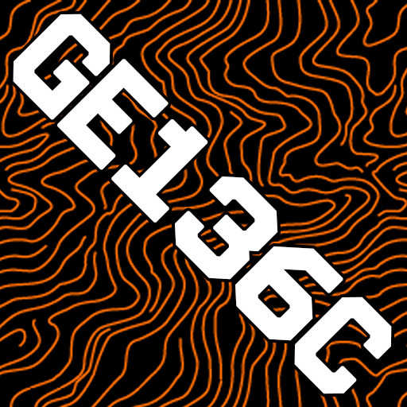

## Festivus Mestivus (FM)

A festival companion app for offline mesh communication. Find your friends, share locations, and stay connected even when cell networks are overloaded.

**Built on [bitchat](https://github.com/permissionlesstech/bitchat)** — a decentralized peer-to-peer messaging protocol with Bluetooth mesh networking.

## Attribution

This project is a fork of [bitchat by permissionlesstech](https://github.com/permissionlesstech/bitchat), which provides the core mesh networking, encryption, and messaging infrastructure. The original bitchat is released into the public domain under [The Unlicense](LICENSE).

**What bitchat provides:**
- Bluetooth LE mesh networking with multi-hop relay
- Noise Protocol end-to-end encryption
- Nostr protocol integration for internet messaging
- Location-based geohash channels
- Core chat UI and message handling

**What Festivus Mestivus adds:**
- Festival mode with schedule/lineup view
- Custom festival channels (#meetup, #lost-found, etc.)
- Stage-based location channels with geohash auto-join
- Friend location sharing on map
- Points of interest (entrances, medical, water)
- Festival-themed UI

## Features

### Festival Mode
- **Schedule View**: Browse lineup by day and stage
- **Now Playing**: See what's on right now
- **Stage Channels**: Auto-join chat for the stage you're near
- **Custom Channels**: #meetup, #lost-found, #rideshare, #food-tips, #setlist
- **Friend Map**: See where your friends are (with their permission)
- **Points of Interest**: Find entrances, medical tents, water stations

### Core Mesh Features (from bitchat)
- **Offline Communication**: Works without cell/wifi via Bluetooth mesh
- **Multi-hop Relay**: Messages route through nearby phones (up to 7 hops)
- **End-to-End Encryption**: Noise Protocol for private messages
- **No Accounts**: No phone numbers, no sign-up, no tracking
- **Emergency Wipe**: Triple-tap to clear all data instantly

## Setup

### For Development

```bash
# Clone the repo
git clone https://github.com/MDunitz/bitchat.git festivus-mestivus
cd festivus-mestivus

# Copy local config
cp Configs/Local.xcconfig.example Configs/Local.xcconfig

# Edit Local.xcconfig and set your DEVELOPMENT_TEAM (10-char Team ID)
# Get it from: Xcode → Settings → Accounts → Your Team

# Open in Xcode
open bitchat.xcodeproj
```

### Customizing the Trip

Edit `bitchat/Features/festival/TripSchedule.json`:

```json
{
  "trip": {
    "name": "Your Trip Name",
    "location": "Venue, City",
    "dates": { "start": "2026-08-07", "end": "2026-08-09" }
  },
  "stages": [
    {
      "id": "main-stage",
      "name": "Main Stage",
      "geohash": "9q8yyk2",
      "latitude": 37.7694,
      "longitude": -122.4862
    }
  ],
  "customChannels": [
    {
      "id": "meetup",
      "name": "#meetup",
      "description": "Find your friends"
    }
  ],
  "sets": [
    {
      "artist": "Artist Name",
      "stage": "main-stage",
      "day": "2026-08-07",
      "start": "20:30",
      "end": "22:00"
    }
  ]
}
```

### Enabling Trip Mode

1. Build and run the app
2. Tap sidebar → App Info (ⓘ)
3. Scroll to "Trip Mode" → Tap to enable

## Technical Architecture

See [bitchat's technical documentation](https://deepwiki.com/permissionlesstech/bitchat) for details on:
- Bluetooth mesh networking
- Noise Protocol encryption
- Nostr protocol integration
- Binary packet format

## License

This project is released into the public domain under [The Unlicense](LICENSE), same as the original bitchat.

## Links

- **Original bitchat**: https://github.com/permissionlesstech/bitchat
- **bitchat on App Store**: https://apps.apple.com/us/app/bitchat-mesh/id6748219622
- **Technical Docs**: https://deepwiki.com/permissionlesstech/bitchat
